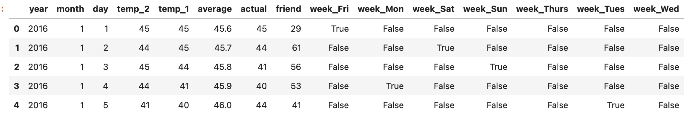
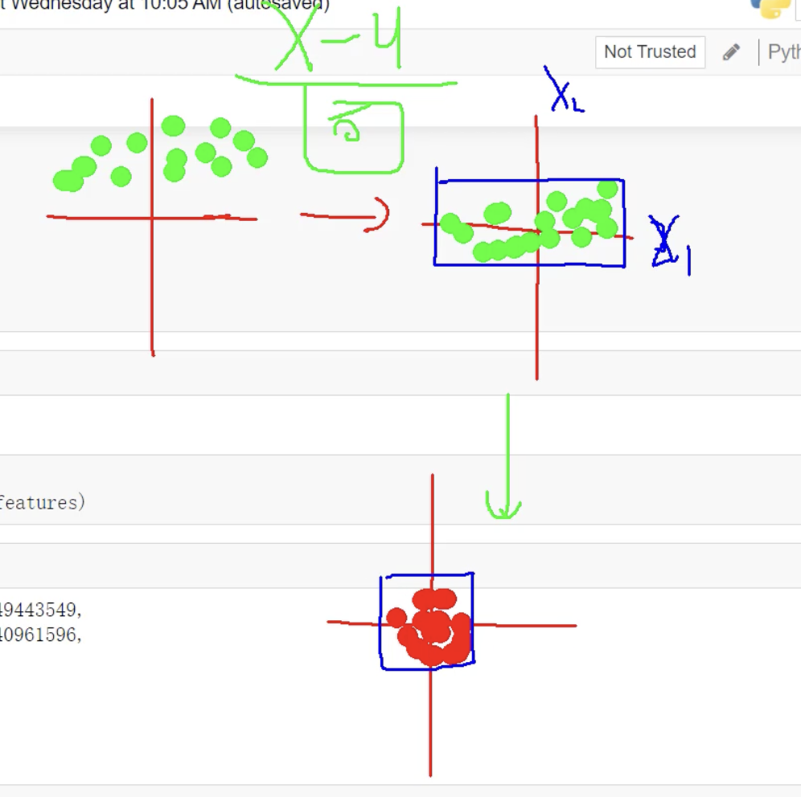

导入必须用的包
```python
import numpy as np # numpy做矩阵计算
import pandas as pd  # pandas 数据基本处理
import matplotlib.pyplot as plt # 画图展示
import torch            # 导入torch框架
import torch.optim as optim #优化器，用于迭代优化模型
import warnings 
warnings.filterwarnings("ignore")  # 忽略一些警告信息
%matplotlib inline  
```

从文档中读取训练数据
```python
features = pd.read_csv('temps.csv') # 读取csv文件里的数据 赋值features
#看看数据长什么样子
features.head()
```

数据表中
- year,moth,day,week分别表示的具体的时间
- temp_2：前天的最高温度值
- temp_1：昨天的最高温度值
- average：在历史中，每年这一天的平均最高温度值
- actual：这就是我们的标签值了，当天的真实最高温度，也就是y。前面的年月日昨天前天历史平均都是参数也就是x， 这样通过x预测y的值
- friend：这一列可能是凑热闹的，你的朋友猜测的可能值，咱们不管它就好了

查看数据纬度
```python
print('数据维度:', features.shape)
#数据纬度(348, 9)， 348是样本的数量， 9是样本数据的纬度，就是9个指标 ,8个指标是x 还有一个就是要预测的y
```

对数据做处理
```python
# 处理时间数据 
import datetime
# 分别得到年，月，日 。  将csv里的年月日数据取出来，变成标准的datetime时间格式， 这样才能用工具画图
years = features['year']
months = features['month']
days = features['day']

# datetime格式 ， 用-拼接 2016-1-1, 这里的写法意思是for遍历years,months,days 将他们的每一个用 '-'拼接，拼接后再赋值给dates，
dates = [str(int(year)) + '-' + str(int(month)) + '-' + str(int(day)) for year, month, day in zip(years, months, days)]
dates = [datetime.datetime.strptime(date, '%Y-%m-%d') for date in dates]
dates[:5]
# 打印dates数组的 前五条记录
```
[datetime.datetime(2016, 1, 1, 0, 0),
 datetime.datetime(2016, 1, 2, 0, 0),
 datetime.datetime(2016, 1, 3, 0, 0),
 datetime.datetime(2016, 1, 4, 0, 0),
 datetime.datetime(2016, 1, 5, 0, 0)]

画图工具
```python
# 准备画图
# 指定默认风格
plt.style.use('fivethirtyeight')

# 设置布局, nrows=2, ncols=2 子图布局2行2列， figsize子图大小
fig, ((ax1, ax2), (ax3, ax4)) = plt.subplots(nrows=2, ncols=2, figsize = (10,10))
# 表的x轴的刻度 写不下， 倾斜45度
fig.autofmt_xdate(rotation = 45)

# 标签值 ，第一张子图， x轴是日期，y轴是标签值(要预测的值Y)
ax1.plot(dates, features['actual'])
# 指定x轴的名字是date y轴的名字是 温度 ，标题是Max Temp
ax1.set_xlabel(''); ax1.set_ylabel('Temperature'); ax1.set_title('Max Temp')

# 昨天
ax2.plot(dates, features['temp_1'])
ax2.set_xlabel(''); ax2.set_ylabel('Temperature'); ax2.set_title('Previous Max Temp')

# 前天
ax3.plot(dates, features['temp_2'])
ax3.set_xlabel('Date'); ax3.set_ylabel('Temperature'); ax3.set_title('Two Days Prior Max Temp')

# 我的逗逼朋友
ax4.plot(dates, features['friend'])
ax4.set_xlabel('Date'); ax4.set_ylabel('Temperature'); ax4.set_title('Friend Estimate')

# 子图之间的间隔
plt.tight_layout(pad=2)
```

数据处理：字符串热编码
```python
# 独热编码，因为csv里的week是字符串 Fir，Sun，Sat需要转成编码， 如下，周一就是 1000000 周二就是0100000 周三就是 0010000
features = pd.get_dummies(features)  #这一行代码就是做这个事情，找到是字符串的那一列，然后看这一列有多少种字符串，就变成多少列，数据按行，在新的对应列上标1 也就是True其他False
features.head(5)
```



数据剥离 x 和 y
```python
# 标签， 将从csv文件读出来的features表数据，的y(目标列，actual)拿出来， 转成np.array格式的数组
labels = np.array(features['actual'])

# 在特征中去掉标签 ， 然后再将actual这一列，目标列drop剔除掉， 剔除掉的结果给features
features= features.drop('actual', axis = 1)

# 名字单独保存一下，以备后患 ，
feature_list = list(features.columns)

# 转换成合适的格式 也转成a p.array格式的数组
features = np.array(features)

features.shape
# (348, 14) 数据经过处理后，将week变成热编码， 特征就从原来的8个， 8-1+7=14个特征了， 原来x是8列特征，去掉一个week变成了7列 热编码特征，就变成了14个
```

```python
# 对数据进行标准化流程处理， 
from sklearn import preprocessing
input_features = preprocessing.StandardScaler().fit_transform(features)
# 这里为什么要做标准化处理， 因为我们希望数据是根据坐标的原点进行对称，这样可以方便观察和处理， 那么怎么让乱七八糟的数据变得好看呢
# 第一步 去均值，数据以x轴为中心进行对称， 例如 10 20 30 均值是20  去均值后变成 -10 0 10 这样数据就会x轴对称
# 第二步 除以标准差，标准差是数据点与均值之间的平均偏差，
'''
标准差是数据分布的一个统计量，用来衡量数据的离散程度或波动程度。它表示数据点与均值之间的平均偏差。标准差越大，数据的波动越大；标准差越小，数据越集中。

为什么减去均值后要除以标准差？
减去均值：
减去均值的目的是将数据中心化，使数据的均值变为0。这种操作可以让数据以原点为中心对称，消除不同特征之间的偏移量。
 
除以标准差：
除以标准差的目的是对数据进行缩放，使数据的分布范围标准化为单位方差（标准差为1）。这可以消除不同特征之间的量纲差异，使它们在同一个尺度上进行比较。

标准化的好处：
加速模型收敛： 在机器学习中，标准化可以帮助梯度下降算法更快地收敛。
提高模型性能： 对于依赖距离的算法（如KNN、SVM），标准化可以避免某些特征对结果的过度影响。
统一特征尺度： 不同特征可能有不同的量纲（如温度是摄氏度，时间是小时），标准化可以让它们在同一尺度上。
'''
# 数据处理后的数据
input_features[0]
```
array([ 0.        , -1.5678393 , -1.65682171, -1.48452388, -1.49443549,
       -1.3470703 , -1.98891668,  2.44131112, -0.40482045, -0.40961596,
       -0.40482045, -0.40482045, -0.41913682, -0.40482045])



开始构建网络模型
```python
x = torch.tensor(input_features, dtype = float) # 数据转换 将数据转tensor,   input_features是经过标准化处理后的特征数据  即x

y = torch.tensor(labels, dtype = float)         # 数据转换 labels 是要预测是目标值 即y

# 权重参数初始化
weights = torch.randn((14, 128), dtype = float, requires_grad = True)  # 输入14特征 输出128神经元 给出权重和偏执 
biases = torch.randn(128, dtype = float, requires_grad = True) 
weights2 = torch.randn((128, 1), dtype = float, requires_grad = True)  # 中间128神经元 输出1个预测值
biases2 = torch.randn(1, dtype = float, requires_grad = True) 

'''
y = w * x + b
  x     *    w1    +   b1  = h1(中间隐藏层)        *  w2       +   b   =    y (预测值)
[1*14]  * [14*128] + [128] = [1*128]         ->  * [128,1]   +  [1]  =       [1]
'''


learning_rate = 0.001 #学习率, 算出梯度也就是方向后 要告诉模型 沿着这个方向走多大的距离，就是步长 学习率
losses = [] # 损失值，每次计算后将损失存下，为了方便看损失变化情况。预测-正确值的差距和

for i in range(1000):
    # 计算隐层
    hidden = x.mm(weights) + biases #  x * w1 + b1 的到 第一层神经网络的中间值
    # 加入激活函数
    hidden = torch.relu(hidden)  # 进行 非线性映射，在这里用的relu是  小于0都等于0，大于0就等于自己，就是忽略不重要的特征
    # 预测结果
    predictions = hidden.mm(weights2) + biases2 # x * w2 + b2
    # 通计算损失
    loss = torch.mean((predictions - y) ** 2)  #  预测值 跟 真实值 差的平方 作为损失
    losses.append(loss.data.numpy())  # 损失存起来，loss后续要画图，但是loss此时还是tensor格式，画图需要[]格式，所以需要进行数据格式的转化
    
    # 打印损失值
    if i % 100 == 0:
        print('loss:', loss)
    #返向传播计算
    loss.backward()
    
    #更新参数
    weights.data.add_(- learning_rate * weights.grad.data)   #验证梯度的反方向去更新， 学习率
    biases.data.add_(- learning_rate * biases.grad.data)
    weights2.data.add_(- learning_rate * weights2.grad.data)
    biases2.data.add_(- learning_rate * biases2.grad.data)


    # 每次迭代都得记得清空
    weights.grad.data.zero_() # 每次迭代 梯度 权重 清零， 不清零会累加
    biases.grad.data.zero_()
    weights2.grad.data.zero_()
    biases2.grad.data.zero_()
```

更简单的模型代码
```python
input_size = input_features.shape[1]  #输入的特征大小
hidden_size = 128                     #隐藏层的特征大小
output_size = 1                       #输出层的特征数
batch_size = 16                       #计算时候的批次个数
my_nn = torch.nn.Sequential( # Sequential按顺序执行，
    torch.nn.Linear(input_size, hidden_size),    #给定输出层和隐藏层的特征量 
    torch.nn.Sigmoid(),                          #给定激活函数
    torch.nn.Linear(hidden_size, output_size),   #给定中间层和输出层的特征量
)
cost = torch.nn.MSELoss(reduction='mean') #计算损失 平均方式
optimizer = torch.optim.Adam(my_nn.parameters(), lr = 0.001) #优化器   Adam(my_nn.parameters()更新所有参数
```

训练网络
```python
# 训练网络
losses = []    #这里将损失定义为[]是为了方便画图用的
for i in range(1000):     # 循环1000次
    batch_loss = []       # loss用于存放计算出来的损失
    # MINI-Batch方法来进行训练
    for start in range(0, len(input_features), batch_size):  # range(开始:0, 结束：总训练数据量，步长是设置的批次大小例如64)
        end = start + batch_size if start + batch_size < len(input_features) else len(input_features)      # 结束值 = 开始+补偿  if 开始+步长<总数  else 总数
        xx = torch.tensor(input_features[start:end], dtype = torch.float, requires_grad = True)            # xx = 训练数据[开始，结束] 转 tensor格式
        yy = torch.tensor(labels[start:end], dtype = torch.float, requires_grad = True)                    # xx = 目标值[开始，结束] 转 tensor格式
        prediction = my_nn(xx)                                                                             # 掉我们上面定义好的 模型函数，输入层、隐藏层、输出层、损失、激活、优化器
        loss = cost(prediction, yy)                                                                        # 计算损失  并赋值   
        optimizer.zero_grad()                                                                              # 清零 
        loss.backward(retain_graph=True)                                                                   # 反向传播     
        optimizer.step()                                                                                   # 继续下一步 
        batch_loss.append(loss.data.numpy())                                                               # 损失存回去
    
    # 打印损失
    if i % 100==0:
        losses.append(np.mean(batch_loss))
        print(i, np.mean(batch_loss))
```
0 34.393368
100 34.265163
200 34.13308
300 33.998333
400 33.861904
500 33.72473
600 33.58677
700 33.447403
800 33.306377
900 33.16375


每一天的预测值
```python
x = torch.tensor(input_features, dtype = torch.float)
predict = my_nn(x).data.numpy()
print(predict)
```
[[47.450592]
 [47.689716]
 [47.865772]
 [47.749664]
 [48.723953]
 [47.60801 ]
 [47.628956]
 [48.66185 ]
 [48.414566]
 [49.342648]
 [50.347347]
 [48.513527]
 [49.45585 ]
 [50.102608]
 [48.61914 ]
 [48.97732 ]
 [51.362408]
 [51.465755]
 [51.69638 ]
 [50.604927]
 [50.645523]
 [49.92984 ]
 [51.50083 ]
 [52.15622 ]
 [52.472336]
 [51.817978]
 [53.003803]
 [52.657448]
 [53.18796 ]
 [53.062527]
 [52.350803]
 [50.238518]
 [51.25547 ]
 [51.86663 ]
 [51.850517]
 [52.04002 ]
 [52.19511 ]
 [52.171417]
 [52.420578]
 [54.178528]
 [55.34767 ]
 [54.954002]
 [53.716125]
 [54.0204  ]
 [54.963306]
 [54.295277]
 [53.866215]
 [54.69853 ]
 [54.089066]
 [54.837616]
 [54.64191 ]
 [55.754787]
 [55.44771 ]
 [55.981247]
 [56.191494]
 [57.90324 ]
 [56.717888]
 [56.327877]
 [56.679234]
 [56.481182]
 [56.964138]
 [56.99929 ]
 [56.745163]
 [56.19702 ]
 [56.35559 ]
 [56.313892]
 [56.64068 ]
 [57.756157]
 [58.101673]
 [55.974545]
 [56.678318]
 [55.45102 ]
 [55.441704]
 [57.832947]
 [58.722145]
 [60.357254]
 [60.39204 ]
 [60.191513]
 [59.250603]
 [58.923214]
 [61.533222]
 [59.92713 ]
 [60.105877]
 [61.780087]
 [61.278103]
 [62.108887]
 [61.517296]
 [63.261967]
 [63.000126]
 [63.205795]
 [63.308487]
 [63.61501 ]
 [63.12507 ]
 [62.515343]
 [62.316635]
 [64.412766]
 [65.59796 ]
 [64.90173 ]
 [64.65234 ]
 [63.00741 ]
 [63.68985 ]
 [64.350235]
 [64.551735]
 [64.25692 ]
 [65.29476 ]
 [67.58656 ]
 [67.67085 ]
 [67.0046  ]
 [66.181946]
 [66.166824]
 [67.395996]
 [66.273254]
 [66.22166 ]
 [65.76514 ]
 [65.622154]
 [67.21617 ]
 [67.897766]
 [66.975426]
 [66.90621 ]
 [68.22986 ]
 [70.15245 ]
 [69.35411 ]
 [68.87733 ]
 [69.00133 ]
 [68.34937 ]
 [71.081955]
 [69.427185]
 [69.20326 ]
 [68.87504 ]
 [68.87782 ]
 [69.90494 ]
 [69.95988 ]
 [68.66597 ]
 [69.05057 ]
 [69.02128 ]
 [68.50071 ]
 [70.326706]
 [69.1949  ]
 [69.24794 ]
 [69.42489 ]
 [69.38628 ]
 [70.1346  ]
 [69.7181  ]
 [70.85397 ]
 [69.98851 ]
 [71.55834 ]
 [70.73687 ]
 [71.396   ]
 [72.23646 ]
 [71.86449 ]
 [71.64653 ]
 [72.11156 ]
 [71.3677  ]
 [72.63334 ]
 [72.401695]
 [72.00485 ]
 [73.15674 ]
 [73.81341 ]
 [71.7677  ]
 [71.0154  ]
 [71.87275 ]
 [70.55122 ]
 [72.62344 ]
 [71.94545 ]
 [71.60191 ]
 [74.06855 ]
 [73.86031 ]
 [72.12391 ]
 [72.144165]
 [73.043106]
 [73.76875 ]
 [72.674194]
 [73.55405 ]
 [73.32419 ]
 [74.58596 ]
 [73.777306]
 [73.41783 ]
 [73.63802 ]
 [74.499214]
 [73.13207 ]
 [73.964935]
 [75.20011 ]
 [73.57312 ]
 [73.97597 ]
 [75.05331 ]
 [74.68497 ]
 [74.55255 ]
 [73.56842 ]
 [74.74097 ]
 [75.2416  ]
 [75.179504]
 [74.56668 ]
 [77.17432 ]
 [76.997826]
 [77.090416]
 [76.102005]
 [76.69837 ]
 [75.89357 ]
 [75.7955  ]
 [76.77435 ]
 [77.379265]
 [78.56789 ]
 [77.18882 ]
 [76.84932 ]
 [75.921234]
 [76.341805]
 [76.49892 ]
 [77.37851 ]
 [78.35504 ]
 [75.587845]
 [76.359924]
 [75.85131 ]
 [76.71112 ]
 [75.995514]
 [77.4191  ]
 [76.06693 ]
 [75.07303 ]
 [75.80483 ]
 [75.754944]
 [75.94951 ]
 [76.551476]
 [76.833664]
 [77.25907 ]
 [76.63945 ]
 [76.58603 ]
 [75.357864]
 [74.8057  ]
 [75.584076]
 [73.00102 ]
 [72.764496]
 [71.3523  ]
 [72.92052 ]
 [72.12935 ]
 [72.91368 ]
 [72.63887 ]
 [72.41319 ]
 [72.2468  ]
 [73.59748 ]
 [71.64293 ]
 [72.473885]
 [73.44389 ]
 [72.29275 ]
 [72.04645 ]
 [71.93316 ]
 [70.971436]
 [69.41722 ]
 [71.346725]
 [70.59999 ]
 [70.42154 ]
 [69.8598  ]
 [70.14624 ]
 [69.245575]
 [69.6431  ]
 [69.01341 ]
 [69.451416]
 [69.32132 ]
 [66.26509 ]
 [65.91272 ]
 [65.777664]
 [66.50818 ]
 [65.52332 ]
 [64.28955 ]
 [66.310524]
 [64.54837 ]
 [64.582344]
 [64.17186 ]
 [63.393253]
 [62.89614 ]
 [63.052376]
 [64.3752  ]
 [61.690624]
 [62.522697]
 [60.78468 ]
 [61.80639 ]
 [62.467804]
 [61.848274]
 [61.55784 ]
 [62.533813]
 [61.18602 ]
 [61.085995]
 [61.224743]
 [61.294594]
 [61.29944 ]
 [60.29434 ]
 [59.434837]
 [59.918247]
 [61.881493]
 [60.222214]
 [58.60595 ]
 [59.134285]
 [59.42347 ]
 [59.782078]
 [58.366962]
 [58.757877]
 [59.35751 ]
 [59.62113 ]
 [60.67916 ]
 [59.565716]
 [58.6381  ]
 [56.94675 ]
 [56.13649 ]
 [56.182045]
 [55.633385]
 [54.29563 ]
 [53.246613]
 [53.43648 ]
 [52.99401 ]
 [53.04488 ]
 [53.69234 ]
 [53.548096]
 [51.608627]
 [50.80818 ]
 [50.56582 ]
 [52.437893]
 [52.009224]
 [52.122944]
 [51.673298]
 [51.328674]
 [49.648262]
 [49.048496]
 [44.09272 ]
 [41.760544]
 [41.70439 ]
 [40.84516 ]
 [42.02835 ]
 [41.07859 ]
 [41.47188 ]
 [39.475063]
 [42.930916]
 [43.3594  ]
 [41.700214]
 [40.695694]
 [40.849075]
 [42.03475 ]
 [40.50029 ]
 [40.44217 ]
 [43.59337 ]
 [46.850918]
 [47.10492 ]
 [46.537914]
 [44.510296]
 [44.8456  ]
 [44.239388]
 [45.629204]
 [44.897083]
 [46.580173]
 [46.24366 ]
 [47.298386]]


