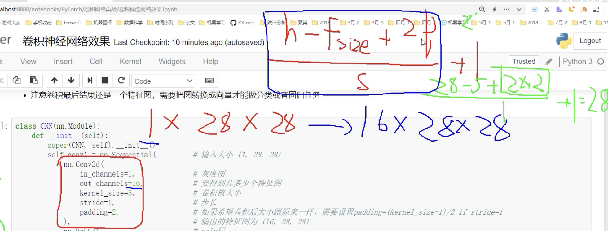

# 卷积网络中的输入和层与传统神经网络有些区别，需重新设计，训练模块基本一致

#  
```python
import torch
import torch.nn as nn
import torch.optim as optim
import torch.nn.functional as F
from torchvision import datasets,transforms 
import matplotlib.pyplot as plt
import numpy as np
%matplotlib inline
```

# 首先读取数据
分别构建训练集和测试集（验证集）
DataLoader来迭代取数据
```python
# 定义超参数 
input_size = 28  #图像的总尺寸28*28
num_classes = 10  #标签的种类数
num_epochs = 3  #训练的总循环周期
batch_size = 64  #一个撮（批次）的大小，64张图片
# 训练集
train_dataset = datasets.MNIST(root='./data',  
                            train=True,   
                            transform=transforms.ToTensor(),  
                            download=True) 

# 测试集
test_dataset = datasets.MNIST(root='./data', 
                           train=False, 
                           transform=transforms.ToTensor())

# 构建batch数据
train_loader = torch.utils.data.DataLoader(dataset=train_dataset, 
                                           batch_size=batch_size, 
                                           shuffle=True)
test_loader = torch.utils.data.DataLoader(dataset=test_dataset, 
                                           batch_size=batch_size, 
                                           shuffle=True)
```

### 卷积网络模块构建
- 一般卷积层，relu层，池化层可以写成一个套餐
- 注意卷积最后结果还是一个特征图，需要把图转换成向量才能做分类或者回归任务
```python
class CNN(nn.Module):
    def __init__(self):
        super(CNN, self).__init__()
        self.conv1 = nn.Sequential(         # 输入大小 (1, 28, 28)
            nn.Conv2d(                      # 2d卷积
                in_channels=1,              # 灰度图， 输入通道数 灰度图的输入 是 1*28*28 1是通道数   像彩色图通道就是3 RGB,灰度图是1
                out_channels=16,            # 要得到几多少个特征图。  卷积核 的个数 ，卷积就是提特征
                kernel_size=5,              # 卷积核大小。 5*5
                stride=1,                   # 步长 就是每次平移到个数
                padding=2,                  # 如果希望卷积后大小跟原来一样，需要设置padding=(kernel_size-1)/2 if stride=1   ，一般都会让输入和输出的大小相同，所以在设计padding的时候向下取整刚刚好，例如 size=5 pading=(5-1)/2=2   size=3 padding=(3-1)/2=1
            ),                              # 输出的特征图为 (16, 28, 28)
            nn.ReLU(),                      # relu层
            nn.MaxPool2d(kernel_size=2),    # 进行池化操作（2x2 区域）, 输出结果为： (16, 14, 14)  maxPool2d变成原来的一半 16,28,28 -> 16,14,14
        )
        self.conv2 = nn.Sequential(         # 下一个套餐的输入 (16, 14, 14)  ,第一层的输出是16 第二层输入就是16
            nn.Conv2d(16, 32, 5, 1, 2),     # 输出 (32, 14, 14)
            nn.ReLU(),                      # relu层
            nn.Conv2d(32, 32, 5, 1, 2),
            nn.ReLU(),
            nn.MaxPool2d(2),                # 输出 (32, 7, 7)
        )
 self.conv3 = nn.Sequential(                # 下一个套餐的输入 (16, 14, 14)
            nn.Conv2d(32, 64, 5, 1, 2),     # 输出 (32, 14, 14)
            nn.ReLU(),                      # 输出 (64, 7, 7)
        )
        
        self.out = nn.Linear(64 * 7 * 7, 10)   # 全连接层得到的结果  ，10分类将上面的输出进行全连接输出10个结果，并用概率表示

    def forward(self, x):   # 前向传播
        x = self.conv1(x)   # 
        x = self.conv2(x)
        x = self.conv3(x)                   # x四个纬度 bath,chanle,h,w
        x = x.view(x.size(0), -1)           # flatten操作，结果为：(batch_size, 32 * 7 * 7)   x.view(x.size(0), -1) 这一步是为了将四维的变成2纬的，  2纬的第一纬 就是bath不变，第二纬-1就是 将后面三个进行乘法计算，    32 * 7 * 7 , 所以 得到的了一个二维结果  才能进行下一步
        output = self.out(x)                # 全连接
        return output
```


# 准确率作为评估标准
```python
def accuracy(predictions, labels): #predictions 预测值 labels 真实值
    pred = torch.max(predictions.data, 1)[1]  # torch.max的返回值 值,索引   结果[1] 就是取索引
    rights = pred.eq(labels.data.view_as(pred)).sum()  # 比较 索引 ， eq比较一样的sum()个数求和
    return rights, len(labels)
```

# 训练网络模型
```python
# 实例化 卷积神经网络 ，因为我们写的步骤都是
net = CNN()   
#损失函数
criterion = nn.CrossEntropyLoss()   #损失函数以后调nn包，交叉墒作为损失函数
#优化器
optimizer = optim.Adam(net.parameters(), lr=0.001) #定义优化器，普通的随机梯度下降算法，  Adam惯性，按照梯度方向和另方向做力的和 学习率0.001肯定是越小越好

#开始训练循环
for epoch in range(num_epochs):v
    #当前epoch的结果保存下来
    train_rights = [] 
        # index                    用枚举遍历   训练数据      
    for batch_idx, (data, target) in enumerate(train_loader):  #针对容器中的每一个批进行循环
        net.train()      #指定训练模式                            
        output = net(data)   # 预测值
        loss = criterion(output, target)  #损失值
        optimizer.zero_grad() #梯度清零
        loss.backward()  #反响传播
        optimizer.step()  #梯度更新
        right = accuracy(output, target) #算准确率 对了多少个
        train_rights.append(right) #把对了多少个保存起来
         
         # 不是每一次循环都跑验证集，隔100次跑一回
         if batch_idx % 100 == 0: 
        
            net.eval() 
            val_rights = [] 
            
            for (data, target) in test_loader:
                output = net(data) 
                right = accuracy(output, target) 
                val_rights.append(right)
                
            #准确率计算
            train_r = (sum([tup[0] for tup in train_rights]), sum([tup[1] for tup in train_rights]))
            val_r = (sum([tup[0] for tup in val_rights]), sum([tup[1] for tup in val_rights]))

            print('当前epoch: {} [{}/{} ({:.0f}%)]\t损失: {:.6f}\t训练集准确率: {:.2f}%\t测试集正确率: {:.2f}%'.format(
                epoch, batch_idx * batch_size, len(train_loader.dataset),
                100. * batch_idx / len(train_loader), 
                loss.data, 
                100. * train_r[0].numpy() / train_r[1], 
                100. * val_r[0].numpy() / val_r[1]))
```
