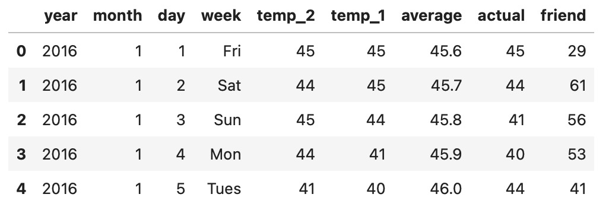

```python
import numpy as np # numpy做矩阵计算
import pandas as pd  # pandas 数据基本处理
import matplotlib.pyplot as plt # 画图展示
import torch            # 导入torch框架
import torch.optim as optim #优化器，用于迭代优化模型
import warnings 
warnings.filterwarnings("ignore")  # 忽略一些警告信息
%matplotlib inline  
```

```python
features = pd.read_csv('temps.csv') # 读取csv文件里的数据 赋值features
#看看数据长什么样子
features.head()
```



