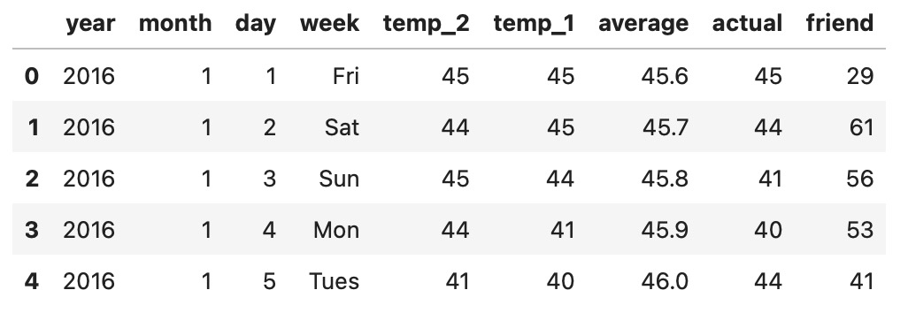
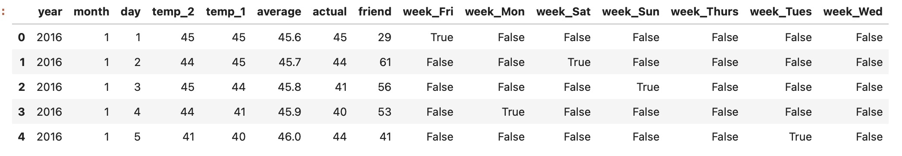
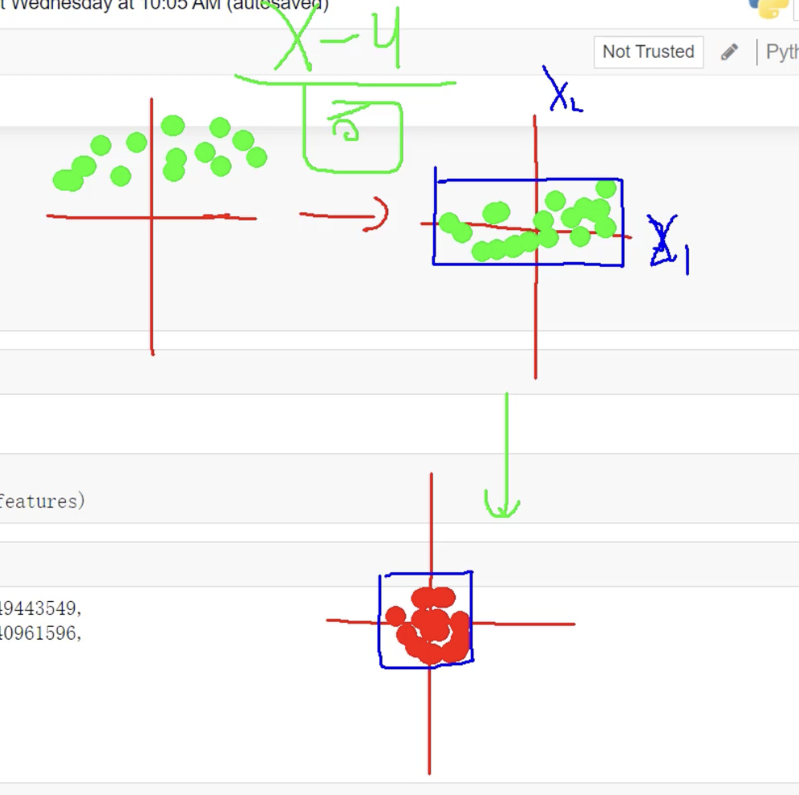

导入必须用的包
```python
import numpy as np # numpy做矩阵计算
import pandas as pd  # pandas 数据基本处理
import matplotlib.pyplot as plt # 画图展示
import torch            # 导入torch框架
import torch.optim as optim #优化器，用于迭代优化模型
import warnings 
warnings.filterwarnings("ignore")  # 忽略一些警告信息
%matplotlib inline  
```

从文档中读取训练数据
```python
features = pd.read_csv('temps.csv') # 读取csv文件里的数据 赋值features
#看看数据长什么样子
features.head()
```

数据表中
- year,moth,day,week分别表示的具体的时间
- temp_2：前天的最高温度值
- temp_1：昨天的最高温度值
- average：在历史中，每年这一天的平均最高温度值
- actual：这就是我们的标签值了，当天的真实最高温度，也就是y。前面的年月日昨天前天历史平均都是参数也就是x， 这样通过x预测y的值
- friend：这一列可能是凑热闹的，你的朋友猜测的可能值，咱们不管它就好了

查看数据纬度
```python
print('数据维度:', features.shape)
#数据纬度(348, 9)， 348是样本的数量， 9是样本数据的纬度，就是9个指标 ,8个指标是x 还有一个就是要预测的y
```

对数据做处理
```python
# 处理时间数据 
import datetime
# 分别得到年，月，日 。  将csv里的年月日数据取出来，变成标准的datetime时间格式， 这样才能用工具画图
years = features['year']
months = features['month']
days = features['day']

# datetime格式 ， 用-拼接 2016-1-1, 这里的写法意思是for遍历years,months,days 将他们的每一个用 '-'拼接，拼接后再赋值给dates，
dates = [str(int(year)) + '-' + str(int(month)) + '-' + str(int(day)) for year, month, day in zip(years, months, days)]
dates = [datetime.datetime.strptime(date, '%Y-%m-%d') for date in dates]
dates[:5]
# 打印dates数组的 前五条记录
```
[datetime.datetime(2016, 1, 1, 0, 0),
 datetime.datetime(2016, 1, 2, 0, 0),
 datetime.datetime(2016, 1, 3, 0, 0),
 datetime.datetime(2016, 1, 4, 0, 0),
 datetime.datetime(2016, 1, 5, 0, 0)]

画图工具
```python
# 准备画图
# 指定默认风格
plt.style.use('fivethirtyeight')

# 设置布局, nrows=2, ncols=2 子图布局2行2列， figsize子图大小
fig, ((ax1, ax2), (ax3, ax4)) = plt.subplots(nrows=2, ncols=2, figsize = (10,10))
# 表的x轴的刻度 写不下， 倾斜45度
fig.autofmt_xdate(rotation = 45)

# 标签值 ，第一张子图， x轴是日期，y轴是标签值(要预测的值Y)
ax1.plot(dates, features['actual'])
# 指定x轴的名字是date y轴的名字是 温度 ，标题是Max Temp
ax1.set_xlabel(''); ax1.set_ylabel('Temperature'); ax1.set_title('Max Temp')

# 昨天
ax2.plot(dates, features['temp_1'])
ax2.set_xlabel(''); ax2.set_ylabel('Temperature'); ax2.set_title('Previous Max Temp')

# 前天
ax3.plot(dates, features['temp_2'])
ax3.set_xlabel('Date'); ax3.set_ylabel('Temperature'); ax3.set_title('Two Days Prior Max Temp')

# 我的逗逼朋友
ax4.plot(dates, features['friend'])
ax4.set_xlabel('Date'); ax4.set_ylabel('Temperature'); ax4.set_title('Friend Estimate')

# 子图之间的间隔
plt.tight_layout(pad=2)
```

数据处理：字符串热编码
```python
# 独热编码，因为csv里的week是字符串 Fir，Sun，Sat需要转成编码， 如下，周一就是 1000000 周二就是0100000 周三就是 0010000
features = pd.get_dummies(features)  #这一行代码就是做这个事情，找到是字符串的那一列，然后看这一列有多少种字符串，就变成多少列，数据按行，在新的对应列上标1 也就是True其他False
features.head(5)
```



数据剥离 x 和 y
```python
# 标签， 将从csv文件读出来的features表数据，的y(目标列，actual)拿出来， 转成np.array格式的数组
labels = np.array(features['actual'])

# 在特征中去掉标签 ， 然后再将actual这一列，目标列drop剔除掉， 剔除掉的结果给features
features= features.drop('actual', axis = 1)

# 名字单独保存一下，以备后患 ，
feature_list = list(features.columns)

# 转换成合适的格式 也转成a p.array格式的数组
features = np.array(features)

features.shape
# (348, 14) 数据经过处理后，将week变成热编码， 特征就从原来的8个， 8-1+7=14个特征了， 原来x是8列特征，去掉一个week变成了7列 热编码特征，就变成了14个
```

```python
# 对数据进行标准化流程处理， 
from sklearn import preprocessing
input_features = preprocessing.StandardScaler().fit_transform(features)
# 这里为什么要做标准化处理， 因为我们希望数据是根据坐标的原点进行对称，这样可以方便观察和处理， 那么怎么让乱七八糟的数据变得好看呢
# 第一步 去均值，数据以x轴为中心进行对称， 例如 10 20 30 均值是20  去均值后变成 -10 0 10 这样数据就会x轴对称
# 第二步 除以标准差，标准差是数据点与均值之间的平均偏差，
'''
标准差是数据分布的一个统计量，用来衡量数据的离散程度或波动程度。它表示数据点与均值之间的平均偏差。标准差越大，数据的波动越大；标准差越小，数据越集中。

为什么减去均值后要除以标准差？
减去均值：
减去均值的目的是将数据中心化，使数据的均值变为0。这种操作可以让数据以原点为中心对称，消除不同特征之间的偏移量。
 
除以标准差：
除以标准差的目的是对数据进行缩放，使数据的分布范围标准化为单位方差（标准差为1）。这可以消除不同特征之间的量纲差异，使它们在同一个尺度上进行比较。

标准化的好处：
加速模型收敛： 在机器学习中，标准化可以帮助梯度下降算法更快地收敛。
提高模型性能： 对于依赖距离的算法（如KNN、SVM），标准化可以避免某些特征对结果的过度影响。
统一特征尺度： 不同特征可能有不同的量纲（如温度是摄氏度，时间是小时），标准化可以让它们在同一尺度上。
'''
# 数据处理后的数据
input_features[0]
```
array([ 0.        , -1.5678393 , -1.65682171, -1.48452388, -1.49443549,
       -1.3470703 , -1.98891668,  2.44131112, -0.40482045, -0.40961596,
       -0.40482045, -0.40482045, -0.41913682, -0.40482045])

